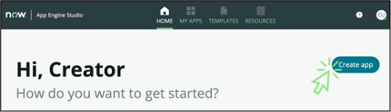
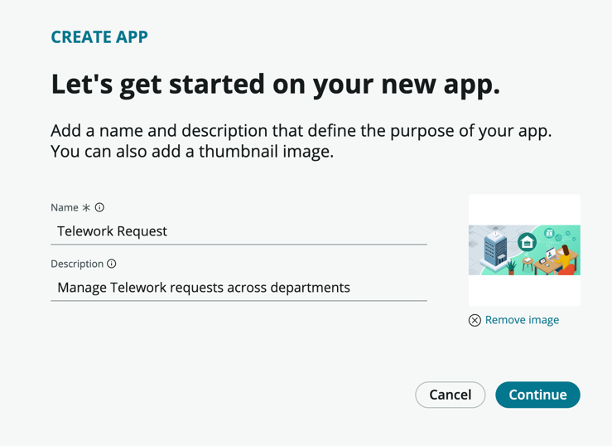

# Create the application

1. Click the \_Create app button

    

1. Configure the app

  1. _Name_: **[your initials]****Telework Request**

_Note: Your initials will prevent you from using the same app name as another lab attendee._

  1. _Description_: **Manage Telework requests across departments**

1. _ **Optional** _ – Add an image to the application. Images can be a great way to personalize and provide character for your application.

  1. Click the Drag app logo or browse to upload tile.
  2. Browse to and select the  **telework App Logo.png** file you downloaded.

1. The screen should look like below

    

1. Click the \_Continue button
2. The screen should look like below
 
3. Click the \_Continue button
4. The app will be created. Once it is finished, click the \_Go to app dashboard button

**Review the guidance**

In this section of the exercise, you will review and turn off Guidance.

1. Read the _Add data_ flyout.

1. In the _Guidance_ pane, click the  **Experience**  tab and read the _Add experience_ flyout.

1. Select each of the tabs in the _Guidance_ pane to review the different application components.
2. Click the  **Guidance**  toggle to turn off the _Guidance_ pane.

1. Optional: Look in the top right corner for the "Enter full screen" button. Click it to maximize your viewing area.

 

 [Next Create the Tables](Part_1.2_Create_the_Data.md){: .btn .btn-green-sn }
