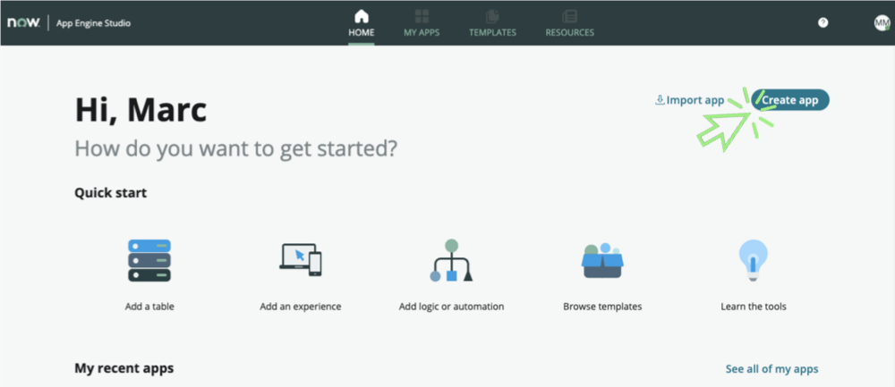

# Create the application

1. Click on the [Create App](#){: .aes_button } button

    

2. Configure the app

    a. _Name_: **Telework Case Management**
    _Note: Your initials will prevent you from using the same app name as another lab attendee._

    b. _Description_: **Manage Telework requests across departments**

3. **Optional** – Add an image to the application. Images can be a great way to personalize and provide character for your application.

    a. Click the app logo or browse to upload tile.

    b. Browse to and select the  **telework App Logo.png** file you downloaded.

4. The screen should look like below

    

5. Click the [Continue](#){: .aes_button } button

6. The screen should look like below

    

7. Click the [Continue](#){: .aes_button } button

8. The app will be created. Once it is finished, Click the [Go to app dashboard](#){: .aes_button } button

    

**Review the guidance**

In this section of the exercise, you will review and turn off Guidance.

9. Read the **Add data** flyout.

    

10. In the _Guidance_ pane, click the  **Experience**  tab and read the _Add experience_ flyout.

    

11. Select each of the tabs in the _Guidance_ pane to review the different application components.

12. Click the  **Guidance**  toggle to turn off the _Guidance_ pane.

    

13. Optional: Look in the top right corner for the "Enter full screen" button. Click it to maximize your viewing area.

    

 [Next Create the Tables](Part_1.2_Create_the_Data.md){: .btn .btn-green-sn }
