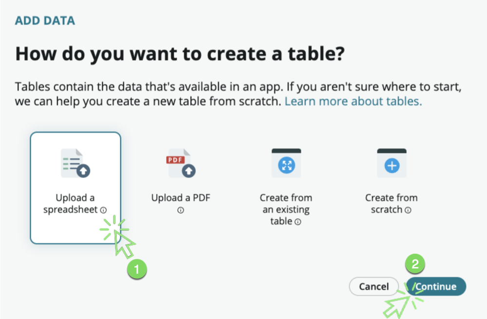
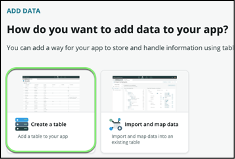
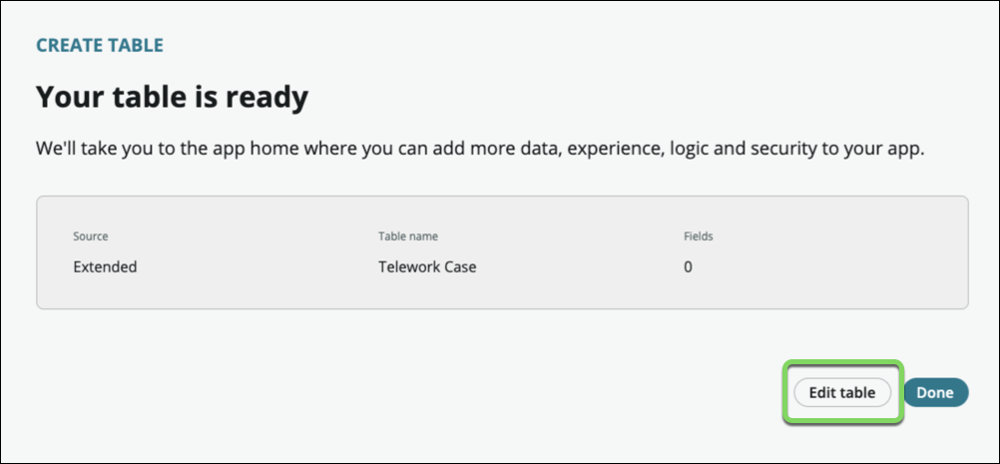
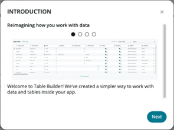

# Create the Data

We will create the core tables for our application. To create a table in App Engine Studio:

1. Click the  **Add**  icon (⨁ Add) for _Data_ on the _App Home_ tab.

    

2. On the _How do you want to add data to your app?_ screen, select the **Create a table** tile.

    

3. Click on the [Get started](#){: .aes_button } button

4. On the _How do you want to create a table?_ screen, select the  **Upload a spreadsheet**  tile.

    

5. Click on the [Continue](#){: .aes_button } button

6. On the _Let's choose the spreadsheet you want to upload_ screen, click the  **Drag and drop or browse to upload spreadsheet** link

    

7. Browse and select the  **Telework Data.xlsx**  file you downloaded

    

8. Click [Continue](#){: .aes_button } button

9. Our spreadsheet has multiple sheets. **We only need the first one** "Telework Arrangement".

10. Select ☑ **Import spreadsheet data** in the "Telework Arrangement" box.

11. Click on **Convert to table** to the right of the Telework Arrangement Sheet name.

    

12. Click the  **Expand/Collapse**  icon (⌄) to see advanced configuration options.

13. Check **Display** : This sets this field as the display value for the table when used as a reference field

    

14. Click [Continue](#){: .aes_button } button

15. Set the table label to **Arrangement**.The table name will auto populate.

    

16. Click [Continue](#){: .aes_button } button

17. Click the "All" checkbox for the "admin" role.
18. Click the "Read" checkbox for the "user" role.

    

19. Click [Continue](#){: .aes_button } button

20. A loading screen will appear while the table is being created. When it completes, click [Done](#){: .aes_button }

21. We haven't converted all the sheets in the spreadsheets, so we'll see this message pop up

    

22. Click [Yes, leave](#){: .aes_button }

23. Again, click the  **Add**  icon (⨁ Add) for _Data_ on the _App Home_ tab.

    

24. On the _How do you want to add data to your app?_ screen, select the **Create a table** tile.

    

25. Click [Begin](#){: .aes_button} button

26. On the _How do you want to create a table?_ screen, Select _ **Create from an existing table** _.

    

27. Click the [Continue](#){: .aes_button } button

28. Type **Task,** then select the table **Task [task]** and Click [Continue](#){: .aes_button }

    

29. Give the table the following properties

    1. **Table label** : Telework Case
    2. Select ☑ Auto number
    3. Set the prefix to TLW.

    

30. Click [Continue](#){: .aes_button }

31. Click the "All" checkbox for the "admin" role.
32. Click the "Create", "Read", and "Write" checkboxes for the "user" role.

    

33. Click [Continue](#){: .aes_button }

34. Once the table is ready, we'lladdourdatacolumnstothisnewtablebyclicking **Edit**** table**.

    

35. We now see the Table Builder screen. From this screen, we can see the fields that were automatically added to our table by the system, as well as add additional columns.

    

1. Review the introduction to Table Builder then **click** the **Next** button to walk through each information pane. From the last screen, **click** the **Get Started** button.
2. Now let's add the data columns for our application. Start by **clicking** the **Add new field** link at the top of the screen

1. In the new row created, add the following values:

  1. Label: **Arrangement**
  2. Hit the [ENTER] key
  3. Column name: arrangement (auto-generated)
  4. Hit the arrow key ▸ [twice]
  5. Hit the [ENTER] key
  6. Type: **Reference** then select Arrangement

1. Again, **click** the **Add new field** link at the top of the screen
2. In the new row created, add the following values:

  1. Label: " **Number of Days**"
  2. Hit the [ENTER] key
  3. Column name: (auto-generated)
  4. Type: **Integer**

# TODO

1. Again, **click** the **Add new field** link at the top of the screen
2. In the new row created, add the following values:

  1. Label: **Reason**
  2. Hit the [ENTER] key
  3. Column name: reason (auto-generated)
  4. Hit the arrow key ▸ [twice]
  5. Hit the [ENTER] key
  6. Type: **Choice**
  7. Choice Type: Dropdown with -- None –
  8. Choices:
    1. Emergency
    2. Occasional
    3. Medical
    4. Reasonable Accommodation
    5. COVID

1. Click \_Done\_
2. We now have all the data elements we need to manage our use case.
3. Click the \_Save\_ button at the top right to finalize your configurations.
4. Congratulations, you've built the first tables in your solution.

**Let's take a look at the form that has been generated for our table and adjust the layout.**

1. At the top-center of the table, click **Form views**

As we created our table by extending the Task table, we inherited some fields we don't need for our use case.

1. Remove the following fields (by clicking the X)

 

    1. Number
    2. Configuration Item,
    3. Active,
    4. Description

Let's add the fields we need

1. The Fields tab to the left is where existing fields can be added. Notice how there are 63 fields available to use

1. Type "Opened by" in the Search box
2. Drag it onto the form
 

 

3. Click on "Formatters"
 

4. Drag the "**Activities (filtered)**" field onto the form below the Short description field.

1. Move the 2 fields " **Arrangement"** and " **Number of Days**" to the main section of the form.

Your form should look like this:

1. On the top right, click \_Save\_ to save the form.

1. Click the **Table** button on the top banner.

1. Click the **Preview** button on the top right.

You'll notice that there's no data

Let's fix that….

[Next: Import Legacy Data](./Part_1.3_Import_Data.md){: .btn .btn-green-sn }

