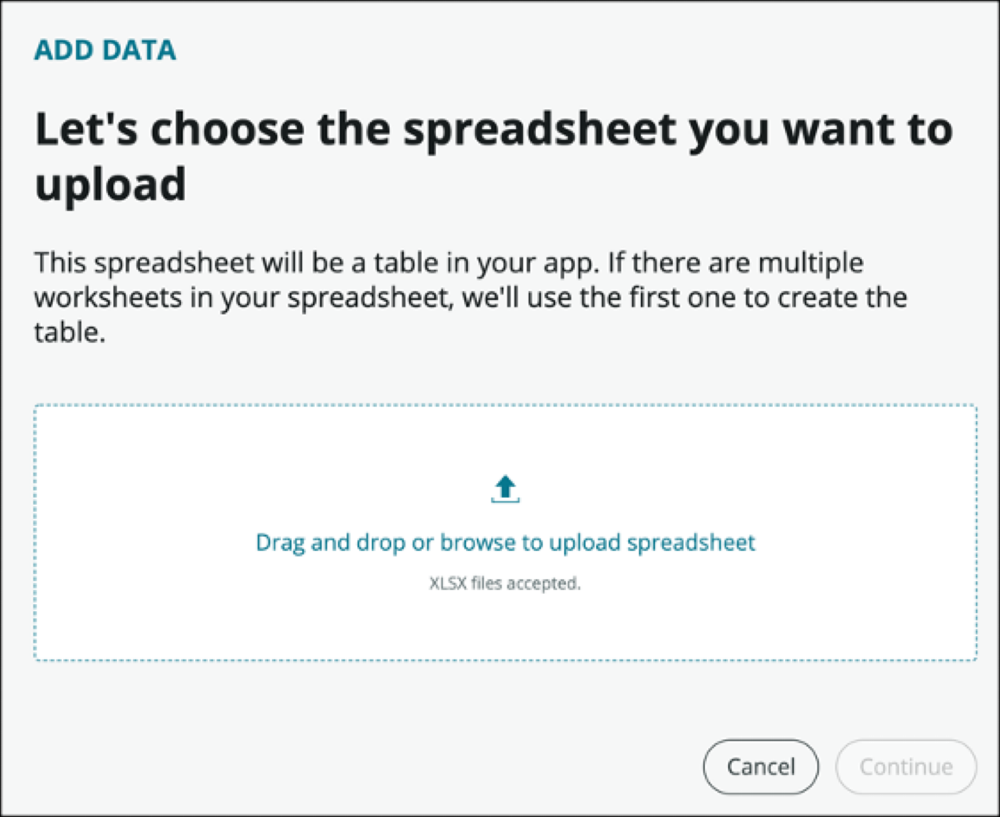
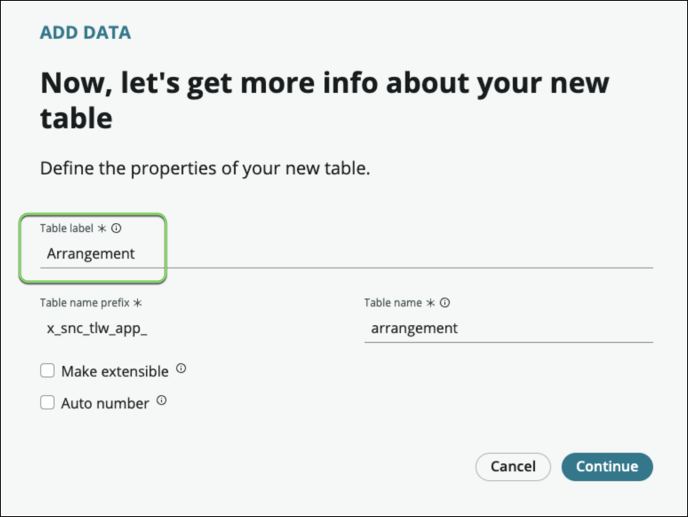
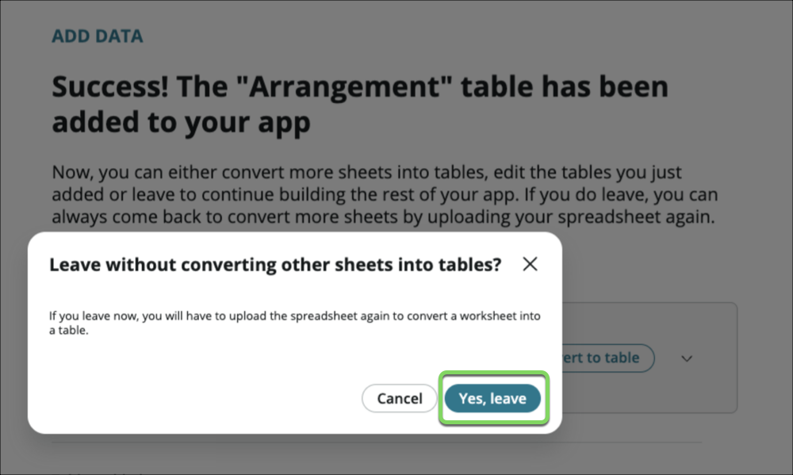
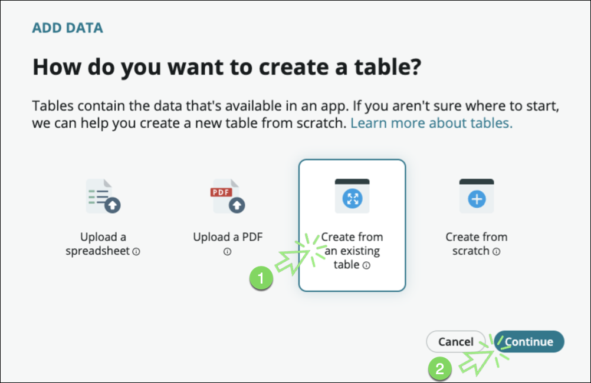
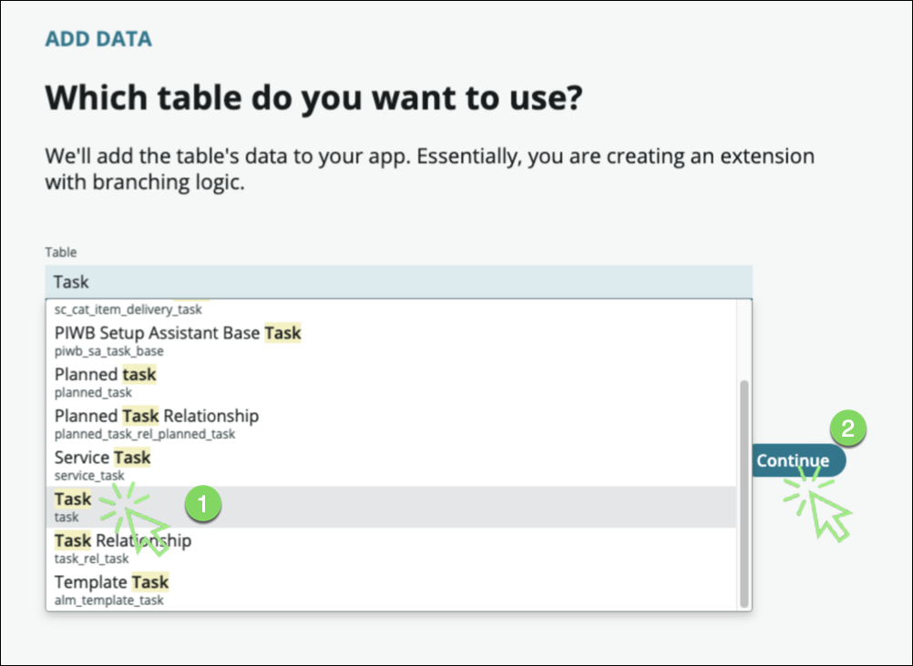
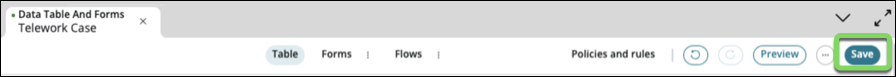
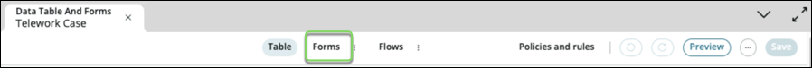
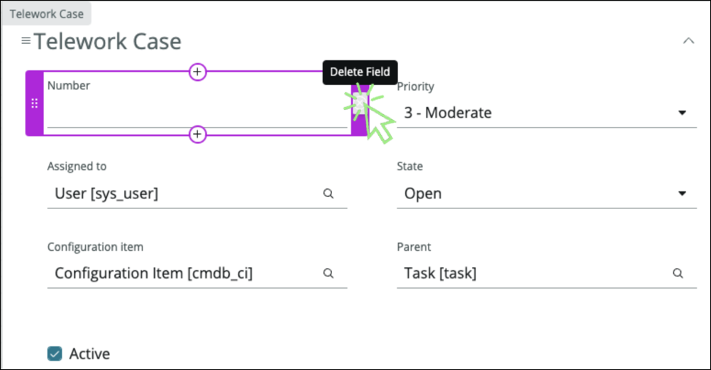
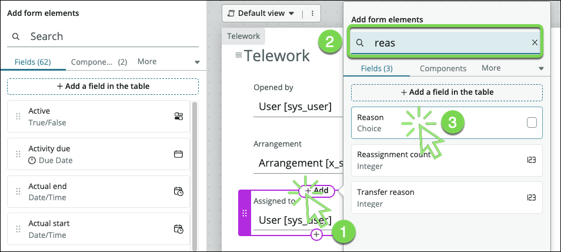
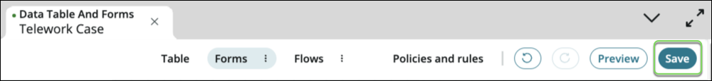

# Create the Data

We will create the core tables for our application. To create a table in App Engine Studio:

1. Click the  **Add**  icon (⨁ Add) for _Data_ on the _App Home_ tab.

    

2. On the _How do you want to add data to your app?_ screen, select the **Create a table** tile.

    

    

3. Click on the [Begin](#){: .aes_button } button

4. On the _How do you want to create a table?_ screen, select the  **Upload a spreadsheet**  tile.

    

5. Click on the [Continue](#){: .aes_button } button

6. On the _Let's choose the spreadsheet you want to upload_ screen, click the  **Drag and drop or browse to upload spreadsheet** link

    

7. Browse and select the  **Telework Data.xlsx**  file you downloaded

    

8. Click the [Continue](#){: .aes_button } button

9. Our spreadsheet has multiple sheets. **We only need the first one** "Telework Arrangement".

10. Select ☑ **Import spreadsheet data** in the "Telework Arrangement" box.

11. Click on **Convert to table** to the right of the Telework Arrangement Sheet name.

    

    {: .note}
    We need to set what value to display when these records will be referenced

12. Let's set the display value

     1. Click the  **Expand/Collapse**  icon (⌄) to see advanced configuration options.

     2. Check **Display**

     3. Click [Continue](#){: .aes_button } button

     

13. Set the table label to **Arrangement**.The table name will auto populate.

    

14. Click [Continue](#){: .aes_button } button

15. For the **admin** role, click the **All** checkbox

16. For the **user** role, click the **All** checkbox and then remove the **Delete** permission

     

17. Click [Continue](#){: .aes_button } button

18. A loading screen will appear while the table is being created. When it completes, click [Done](#){: .aes_button }

19. We haven't converted all the sheets in the spreadsheets, so we'll see this message pop up

    

20. Click [Yes, leave](#){: .aes_button }

21. Again, click the  **Add**  icon (⨁ Add) for _Data_ on the _App Home_ tab.

    

22. On the _How do you want to add data to your app?_ screen, select the **Create a table** tile.

    

23. Click [Begin](#){: .aes_button} button

24. On the _How do you want to create a table?_ screen, Select **Create from an existing table**.

    

25. Click the [Continue](#){: .aes_button } button

26. Type **Task,** then select the table **Task [task]** and Click [Continue](#){: .aes_button }

    

27. Give the table the following properties

    Field Name      | Field Value
    ----------------| --------------
    (1) Table label | Telework Case
    (2) Auto number | Checked ☑
    (3) Prefix      | TLW

    {: .note }
    You can add an identifiable tracking number to your records to make them easier to manage and follow. Selecting this option will automatically add your designated tracking number to each record in this table.

    

28. Click [Continue](#){: .aes_button }

29. Click the **All** checkbox for the **admin** role.

30. Click the **Create**, **Read**, and **Write** checkbox for the **user** role.

    

31. Click [Continue](#){: .aes_button }

32. Once the table is ready, let's add the fields (columns) we need. Clic **Edit table**.

    

33. Close the guide to the Table Builder screen

    

    {: .note}
    We can see all the fields that our table inherited from the Task table, making building applications faster.

34. Let's add the fields for our application. **Click** the **Add new field** link at the top of the screen

    

35. In the new row created, add the following values:

    1. Label: **Arrangement**
    2. Hit the [ENTER] key
    3. Column name: arrangement (auto-generated)
    4. Hit the arrow key ▸ [twice]
    5. Hit the [ENTER] key
    6. Type: **Reference** then select Arrangement

    

36. Again, **click** the **Add new field** link at the top of the screen

37. In the new row created, add the following values:

    1. Label: " **Days per week**"
    2. Hit the [ENTER] key
    3. Column name: (auto-generated)
    4. Type: **Integer**

38. Again, **click** the **Add new field** link at the top of the screen

39. In the new row created, add the following values:

    1. Label: **Reason**
    2. Hit the [ENTER] key
    3. Column name: reason (auto-generated)
    4. Hit the arrow key ▸ [twice]
    5. Hit the [ENTER] key
    6. Type: **Choice**
    7. Choice Type: Dropdown with -- None –
    8. Choices:
        1. Dependent Care
        2. Medical
        3. Reasonable Accommodation

    

40. Click [Done](#){: .aes_button }

41. We now have all the data elements we need to manage our use case. Click  the **filter options** button  and then select **Hide extended fields**. You should have 3 fields as below:

    

42. Click the [Save](#){: .aes_button } button at the top right to finalize your configurations.

    

43. Congratulations, you've built the first tables in your solution.

    **Let's take a look at the form that has been generated for our table and adjust the layout.**

44. At the top-center of the table, click **Form views**

    

    As we created our table by extending the Task table, we inherited some fields we don't need for our use case.

45. Remove the following fields (by clicking the X)

    1. Number
    2. Configuration Item
    3. Active
    4. Parent

    

46. Users want to see who opened the case. We can easily fulfill the requirement by reusing the **Opened by** field from the Task table. In the Fields tab to the left is where existing fields can be added. Notice how there are 63 fields available to use.

47. Click the circled plus icon ⊕ to add a field above

    

48. (1) Type **Opened by** in the Search box and then (2) click on the **Opened by** field

    

49. Repeat the operation to add the field **Arrangement**

    

50. Add the field **Days per week**

    

51. Add the field **Reason**

    

52. Now we'll add the Activity formatter that provides a way to present the audit history of a particular record

53. (1) Click **More**  and then (2) click **Formatters**

    

54. Drag the "**Activities (filtered)**" field onto the form below the Short description field.

    

55. Your form should look like this:

    

56. On the top right, click [Save](#){: .aes_button }

    

**Exercise Recap**

In this exercise, we learned how to create a new application and map out the data elements important to enable our business process.

We learned to use the Table Builder to add and configure columns including Reference fields and Choice lists.

We were able to complete all these tasks using simple point-and-click administration and without requiring specialized application or database knowledge.

[Next: User Experience](../Part_2_The_User_Experience/Part_2.0_Main.md){: .btn .btn-green-sn }