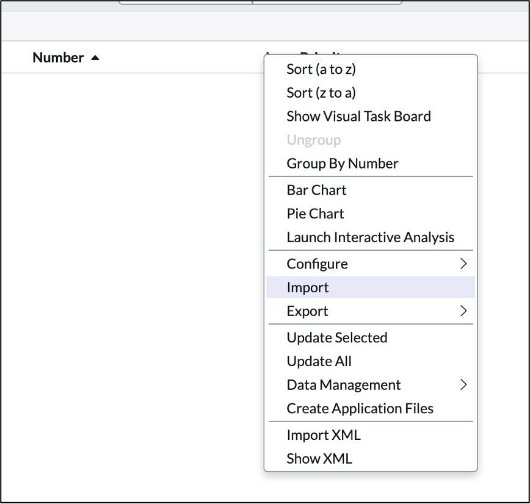

## Section 3 – Import Legacy Data

1. Hover the column header **Number** , **right-click** to display the table menu options and then select **Import.**

  

2. Select **Choose File** to upload the Excel file: Telework Cases.xlsx

  

3. Click \_Upload and wait until the import is complete.

1. Once loaded, click on **Preview Imported Data**

1. Scroll down and click on the **Complete Import** button
 

1. You'll now see that we have migrated our data.

1. Let's update the columns in this list layout.
2. Right click at the top of the Number column and click on "Configure" -\> "List Layout"

1. Move "Task type" to the left hand window and click Save

 

Next, let's start working and managing our records

1. Hover the column header **Priority** , **right-click** to display the menu and then select **Pie Chart**

1. And voila, we get a Pie chart that shows us the distribution of cases by Priority

1. Explore the other tools in the Context Menu such as Visual Task Board

1. The team struggles managing and understand the status of related tasks. Let's fix that.

2. Click the back button on the Pie Chart report to get back to the list
 
3. Open a record by clicking the number field

1. Right-click on header

  1. Select **Configure**
  2. Then select **Related Lists**

1. In the new form:

  1. Select the item " **Task -\> Parent**"
  2. Click on the button to move the item to the selected list

  1. Click \_Save\_

Now a new tab at the bottom of the form will show records that have relationships to the current record.

1. Go back to the list view by clicking on the back button at the top

1. We can even start creating new records/cases

2. Click \_New\_ in the top right
 

1. Fill out the form and click "Submit" to create a test record.
2. Close the Table Builder and Preview tab by **clicking** the **X** on them.
 
3. Next, we'll work on configuring the user experience.

**Exercise Recap**

In this exercise, we learned how to create a new application and map out the data elements important to enable our business process.

We learned to use the Table Builder to add and configure columns including Reference fields and Choice lists.

We were able to complete all these tasks using simple point-and-click administration and without requiring specialized application or database knowledge.

[Next: User Interface]( ../Part_2_The_User_Experience/Part_2.0_Main.html){: .btn .btn-green-sn }