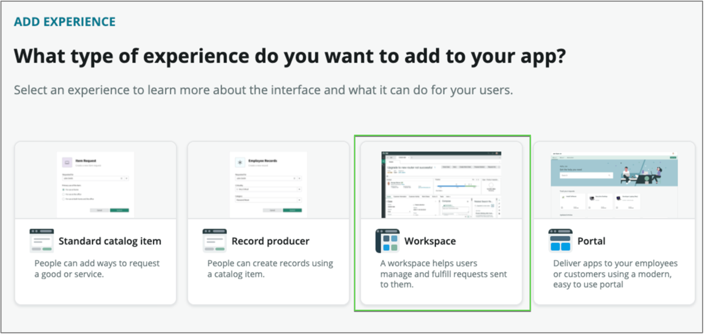

## 1 – Create a Workspace Experience

We will now create and configure the core Workspace experience for our new application.

1. On the application homepage, locate the **Experience** section and click the **⨁ Add icon**
    
    This takes us to a selection where we can identify the type of experience we wish to create.

2. **Click** the **Workspace** option to create a workspace to help users manage and fulfill requests sent to them
    

3. Thislaunches the workspace Creator. Click the [Get Started](#){: .aes_button } button
    

4. Next, provide the following information:
    1. **Name:** leave the default value
    2. **Description:** (optional)
    3. **URL:** leave the default value
    4. **Roles:** leave the default values
    

5. Click [Continue](#){: .aes_button }

6. Next, we'll select the data tables we want to work with in this experience.

7. Remove any unnecessary table, by clicking on the X at the end of the table name.

    

8. Set the **primary** and secondary tables to: **Telework**** Case **and** Arrangement** like below:

    

9. Click [Continue](#){: .aes_button }

10. Your new Workspace experience is completed.  Click [Done](#){: .aes_button } to return to the App Home page
    

11. From the App Home page, **click** the **Preview** link by your newly created Experience
    

12. We now have a fully functioning workspace to get work done.

13. Click on **Critical Tasks**
    

14. Select all rows, Click **Edit** , Select **Assign to me** , Click **Back**
    

15. You now have 2 tasks assigned to you.
    

16. In the **My Work** list, click on the Refresh icon to see the new tasks
    

17. **Great!** Now let's see how quick we can handle an emergency ⚠️.

 Our team member _Luke Wilson_ is out sick today. We need to reassign his work to another case worker. (_It is hard to do when the work is managed via emails and spreadsheets!_)

### Bulk Assignment

1. Click the List icon. 

2. Click on **Open** in the Telework Case section
 

3. Click the button next to "Luke Wilson" and click "Show Matching"
 

4. Select all rows, then click **Edit**
 

5. Type "Andrew Och" in the "Assigned to" field, then click his name in the drop down
 
6. Click Update
7. You should see this message:
 

### Finding Answers with the Analytics Center

1. Now let's check the Analytics Center to quickly find the data we need
2. Click the Analytics Center button
 

1. Let's ask some question about our data
2. Note: As you type in a query, Analytics Q&A suggests recent searches, indicators, tables, and columns that match what you have typed so far. Only the tables and columns to which you have access are shownClick In the box "What do you want to see?" then type the following query:

 "show me all the telework cases grouped by reason as a bar chart"

 

3. Click the button Ask

1. And here is the answer

1. In the query box remove the part "show me all the". It should read as:
 "telework cases grouped by reason as bar chart"
2. Click the Ask button, and we'll get the same result
3. Try with "as pie chart"
4. Try with "as list". (You can ask for a list first, ex: "list of telework cases grouped by reason"
5. It even understands our own data; Try with "open COVID telework case"

**Exercise Recap**

In this exercise, we learned how to generate a new Workspace and explored the out-of-the-box capabilities.