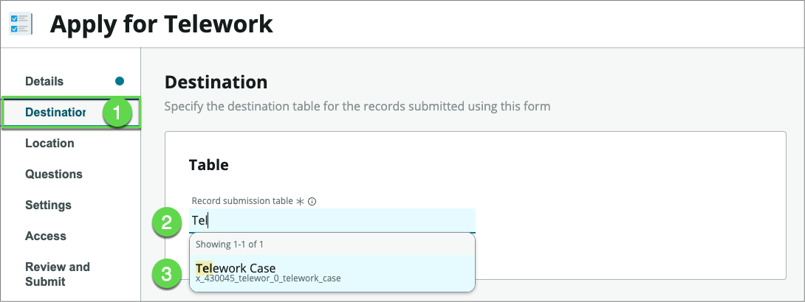
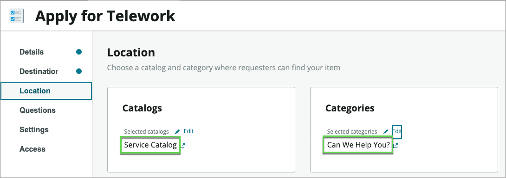
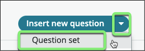
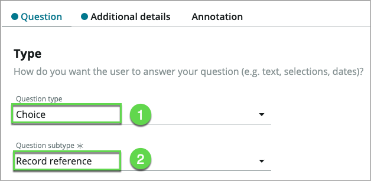
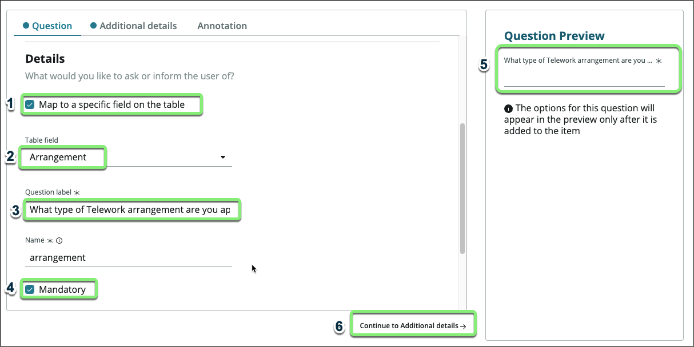

# Create the Request Form

## Purpose

ServiceNow offers multiple ways to create a user experience for submitting a form. In this exercise, we will learn one quick way to get users off paper forms and emails.

1. Close the "Now Experience – Telework Request" App Engine Studio tab
 

2. On the application homepage, locate the Experience section and click the ⨁ Add icon.
 

This takes us to a selection where we can identify the type of experience we wish to create.

1. **Select** the **Record Producer** option.

    

1. This launches the record producer creator.

2. Click the [Begin](#){: .aes_button } button

3. Set the following values (💡 double-click, copy & paste into the form)

    Field Name        | Field Value
    ------------------| --------------
    Name              | Apply for Telework
    Short Description | Use this form to apply for Telework

    {: .note }
    A record producer is a specific type of catalog item that allows end users to create task-based records from the service catalog.

4. Click the [Continue](#){: .aes_button } button

5. Click the [Edit record producer](#){: .aes_button } button

6. Click on **Destination** , then type ** Tel**, and select the **Telework Case** table

    

7. Click on **Location** , then under **Catalogs**, click on **Browse**.

    

8. Click on **Service Catalog** , then click on the right arrow to move the item over to the Selected list

    

9. At the bottom, click on the [Save selections](#){: .aes_button } buttonn

10. Under **Categories** , **click** on **Browse**

11. Move **Can We Help You?** to the right-hand side and click on the [Save selections](#){: .aes_button } buttonn

    Your screen should look like below
    

12. Let's add questions to the form

    {: .note }
    Unlike in a paper-based form, we don't need to ask users to fill personal information like first name, last name, …, or date of request. That information will be automatically attached to the case. This makes filling forms so much faster.

13. We want to allow users to open a case on behalf of another individual, so let's start by asking users " **Who is this request for?**" and " **When do you need this?"**

14. **Click** on Questions

15. **Click the arrow next to** Insert new questionthen click "Question set"

    

16. Select "Standard Employee Questions" and click Submit

    

17. One key information we need users to provide is the type of arrangement they are applying for.
    1. Click Insert new question
    2. For Question type, select **Choice**
    3. For **Question subtype** , select **Record reference**

    
    
    4. Scroll down to the **Details** section

    5. In the **Details** section, enter the following information: (💡 double-click, copy & paste into the form)

        Field Name                   | Field Value
        -----------------------------| --------------
        **Map to a specific field**  | We want to store that information so let's check the box
        **Table field**              | choose **Arrangement**
        **Question label**           | What type of Telework arrangement are you applying for? |
        **Mandatory**                | Checked |

        {: .note }
        Notice the **Question Preview** that shows what the question will look like to the user.

        

    6. Click on **Continue to Additional details →**

    7. In the **Additional details** section, we'll use the data we imported earlier as options for this question.

 Enter the following information:

|

  1. **Source Table**
 | Select **Arrangement** |
| --- | --- |
|

  1. Click on the **Annotation** tab
 |

    
  2. Paste it into the Annotation section of the Telework Form (⌘ Cmd  or CTRL+V )

  1. **Click** on \_ Insert Question \_

    

|

  1. **Map to a specific field**
 | Check the box |
| --- | --- |
|

  1. **Table field**
 | choose **Number of Days per Week?** |
|

  1. **Question label**
 | Number of Days per Week? |
|

  1. Click on **Additional details**
 |

    ![relative](./user_form

1. In the **Additional details** section,

  1. For the **Text validation** field, select **Number**
  2. **Click** on \_Insert Question\_

1. Back to the **Questions** page, we're going to define dynamic behavior of this question based on the answer to the previous questions

  1. Click on the **Define behavior** icon
  2. Click on the **Define new behavior** icon

     and_ _ **Service Management Virtual Agent Topic Blocks** _ _(com.glideapp.cs.sm\_topic\_blocks)._
  1.
  2. _Additional setup beyond that is required to get NLU to perform a topic conversation via the Virtual Agent._
  3.
  4. _Feel free to experiment this after completing the entire lab._
**Close** the Preview by clicking on the X on the top right

 

Let's publish the form

  1. **Click** on **Review and Submit**
  2. **Click** on \_ Submit \_

Congratulations. The form is published on your development instance.

**Let's see how users can easily find it on the Service Portal**

1. Navigate to https://\<instance\>.service-now.com/sp to view the Service Portal
2. Search for "Telework"

1. The catalog item is found.
2. Click on the item to apply for Telework

1. In the **Details** section, enter the following information: (💡 double-click, copy & paste into the form)

|

  1. Who is this request for?
 | **David Loo** |
| --- | --- |
|

  1. When do you need this?
 | **Next week** |
|

  1. What type of arrangement?
 | **Situational** |
|

  1. Number of days per week
 | **3** |
|

  1. Click \_Submit\_
 |

**Exercise Recap**

In this exercise, we learned how Use App Engine Studio (AES) to easily create customized Catalog Items that users can access in Service Portal and on mobile devices.

Our next exercise will focus on taking the building blocks created to this point and making them actionable to drive automation and process optimization