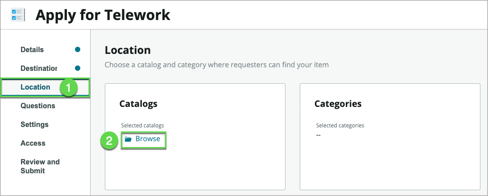
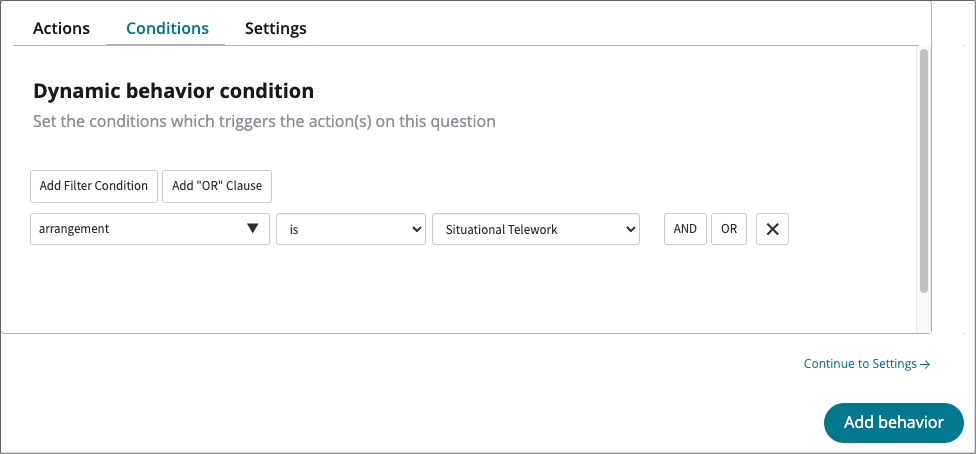
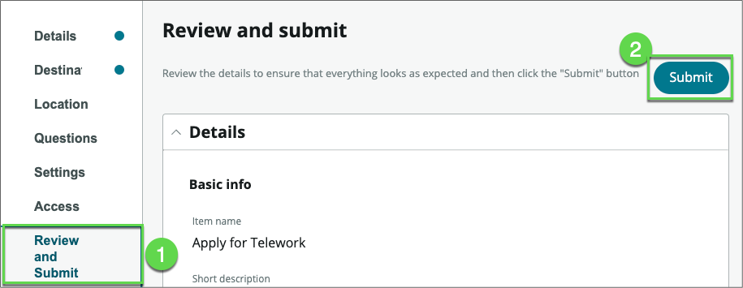
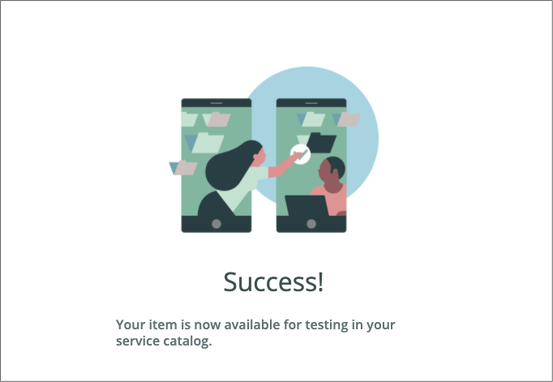
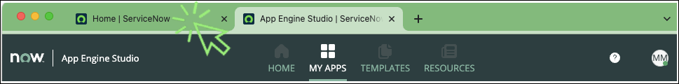
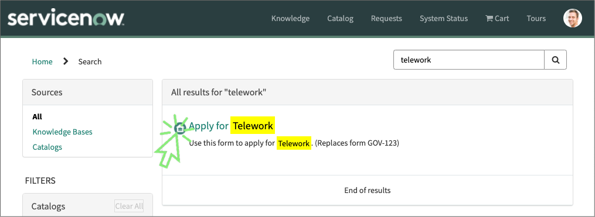

# Create the Request Form

## Purpose

ServiceNow offers multiple ways to create a user experience for submitting a form. In this exercise, we will learn one quick way to get users off paper forms and emails.

1. Close the "Now Experience – Telework Request" App Engine Studio tab
 

2. On the application homepage, locate the Experience section and click the ⨁ Add icon.
 

This takes us to a selection where we can identify the type of experience we wish to create.

3. **Select** the **Record Producer** option.

    

1. This launches the record producer creator.

2. Click the [Begin](#){: .aes_button } button

3. Set the following values (💡 double-click, copy & paste into the form)

    Field Name            | Field Value
    ----------------------| --------------
    (1) Name              | Apply for Telework
    (2) Short Description | Use this form to apply for Telework

    

    {: .note }
    A record producer is a specific type of catalog item that allows end users to create task-based records from the service catalog.

4. Click the [Continue](#){: .aes_button } button

5. Click the [Edit record producer](#){: .aes_button } button

6. Click on **Destination** , then type **Tel**, and select the **Telework Case** table

    

7. Click on **Location** , then under **Catalogs**, click on **Browse**.

    

8. Click on **Service Catalog** , then click on the right arrow to move the item over to the Selected list

    

9. At the bottom, click on the [Save selections](#){: .aes_button } buttonn

10. Under **Categories** , **click** on **Browse**

11. Move **Can We Help You?** to the right-hand side and click on the [Save selections](#){: .aes_button } buttonn

    Your screen should look like below
    

12. Let's add questions to the form

    {: .note }
    Unlike in a paper-based form, we don't need to ask users to fill personal information like first name, last name, …, or date of request. That information will be automatically attached to the case. This makes filling forms so much faster.

13. We want to allow users to open a case on behalf of another individual, so let's start by asking users " **Who is this request for?**" and " **When do you need this?"**

14. **Click** on Questions

15. **Click the arrow next to** Insert new questionthen click "Question set"

    

16. Select "Standard Employee Questions" and click Submit

    

    This will add two frequently asked questions on forms
    

17. One key information we need users to provide is the type of arrangement they are applying for.
    1. Click Insert new question
    2. For Question type, select **Choice**
    3. For **Question subtype** , select **Record reference**

    

    4. Scroll down to the **Details** section

    5. In the **Details** section, enter the following information: (💡 double-click, copy & paste into the form)

        Field Name                   | Field Value
        -----------------------------| --------------
        **Map to a specific field**  | We want to store that information so let's check the box
        **Table field**              | choose **Arrangement**
        **Question label**           | What type of Telework arrangement are you applying for? |
        **Mandatory**                | Checked |

        {: .note }
        Notice the **Question Preview** that shows what the question will look like to the user.

        

    6. Click on **Continue to Additional details →**

    7. In the **Additional details** section, set the **Source Table** to the **Arrangement** table we imported earlier. 
     as options for this question.

    8. then Click on the **Annotation** tab

        

    9. Today, the team is spending a lot of time correcting and manually re-routing applications due to people confusing the different types of Telework arrangement. Let's fix that.

    10. We'll use the  **Annotation**  tab to provide users with additional instructions for the question.

    11. Check the box **Show**** instructions**

    12. Open the file: **telework form annotation.docx**

    13. Copy all the text in the file ( ⌘ Cmd  or CTRL+A, CTRL+C )

    14. Paste it into the Annotation section of the Telework Form (⌘ Cmd  or CTRL+V )

    15. **Click** on the [Insert Question](#){: .aes_button } button

    

18. Back to the main form, **click** on the [Insert new question](#){: .aes_button } button

    

19. When users select the arrangement type **Situational** , we'll prompt them for the number of days per week. 

    1. So, let's go ahead and in the **Type** section set the following values:

        Field Name                    | Field Value
         -----------------------------| --------------
         Question type                | Text
         Question subtype             | Single line

        

    2. Scroll down to the **Details** section

    3. In the **Details** section, enter the following information: (💡 double-click, copy & paste into the form)

        Field Name                   | Field Value
        -----------------------------| --------------
        Map to a specific field      | Checked
        Table field                  | Days per week
        Question label	             | Number of Days per Week?

    4. Click on **Additional details**

        

    5. In the **Additional details** section, for the **Text validation** field, select **Number**

    6. Click on **Insert Question**

20. Back to the **Questions** page, we're going to define the dynamic behavior of this question based on the answer to the previous question.

    1. Click on the **behavior** icon
    2. Click on the **Define new behavior** icon

    

    3. In the **Actions** tab, we'll specify the behavior we need:

        Field Name                     | Field Value
        ------------------------------ | --------------
        ① Make the question mandatory | Yes
        ② Make the question visible   | Yes

        ③ Click on the **Conditions** tab

        

    4. In the **Conditions** tab,

        1. Set the filter to [arrangement] [is] [Situational Telework]

        2. Click on the [Add behavior](#){: .aes_button } button

        

21. Back to the questions page,

    ① Click on the [Save](#){: .aes_button } button

    ② Click on Preview

    1. **Click** on the [Save](#){: .aes_button } button

    2. Click on Preview

    

22. The **Preview** page allows to visualize what our form will look like in different experiences. (You can interact with the item but not submit it).

    | **Mobile** | **Portal** |
    | --- | --- |
    |  |    |

23. Close the Preview by clicking on the X on the top right

    

    {: .note }
    If you want to preview your catalog item in the Virtual Agent you will need to activate the plugins_ _ **Glide Virtual Agent** and **Service Management Virtual Agent Topic Blocks**.
    Additional setup beyond that is required to get NLU to perform a topic conversation via the Virtual Agent.
    Feel free to experiment this after completing the entire lab.

24. Let's publish the form to the Service Portal

    1. Click on **Review and Submit**
    2. Click on Submit
   

25. Congratulations. The form is published on your development instance.

    

26. Let's see how users can easily find it on the Service Portal

27. Go to the tab with ServiceNow Admin Home page

    

28. and then open the Service Portal
    1. Click All
    2. Type **Portal**
    3. Click on **Service Portal**

    

28. In the portal, search for "Telework"

    

29. The catalog item is found.

31. Click on the item to apply for Telework

    

32. In the **Details** section, enter the following information: (💡 double-click, copy & paste into the form)

    Field Name                     | Field Value
    ------------------------------ | --------------
    (1) Who is this request for?   | David Loo
    (2) When do you need this?     | This week
    (3) What type of arrangement?  | Situational
    (4) Number of days per week?   | 3

    5) Click on the [Submit](#){: .aes_button } button

    

**Exercise Recap**

In this exercise, we learned how to use App Engine Studio (AES) to easily create customized Catalog Items that users can access in Service Portal and on mobile devices.

Our next exercise will focus on taking the building blocks created to this point and making them actionable to drive automation and process optimization

[Next > Automate Work](../Part_3_Automate_Work/Part_3.0_Main.md){: .btn .btn-green-sn }