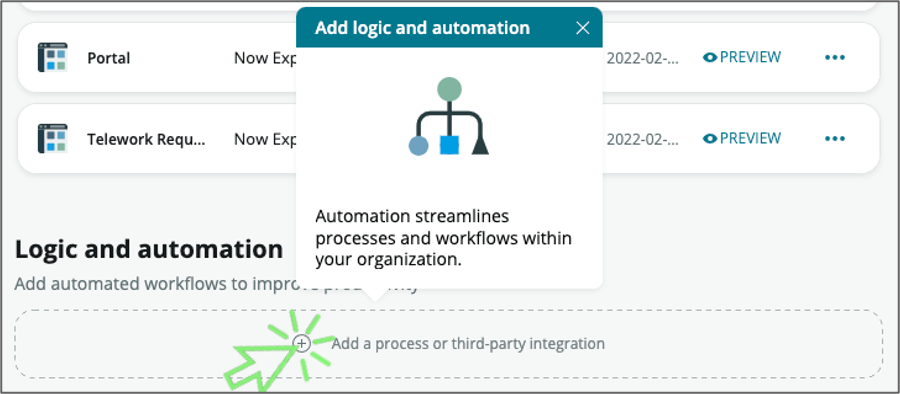
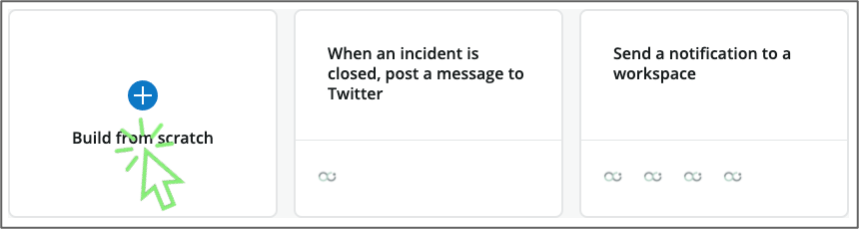
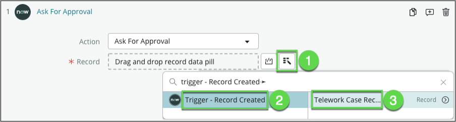
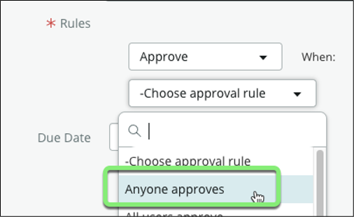

# Part 3 – Create a Workflow

1. Back to the App Engine tab, **click** on the [Return to my application](#){: .aes_button }

    

2. In the Automation section, **click** the **Add a process or third-party integration** link

    

    From the Add Automation Screen, we are provided with a variety of process automation templates we can use to speed creation of common activities.

3. Click "Flow"

    

4. Click **Build**** from ****scratch** to create a new workflow

    

    A flow is a sequence of actions to automate processes on the Now Platform.

    Logic and automation use computers to manage repeatable processes instead of using people. Logic and automation can reduce human error and speed up processes. App Engine Studio allows creators to add process flows to their applications.

5. Create the flow with the following information:

    1. Name: Main

    2. Description: Manage the Telework flow of work

    3. Click [Continue](#){: .aes_button }
|
6. **click** the **Edit this flow** button to begin the configuration process

    

7. Since this is the first time we've launched Flow Designer, we're given the opportunity to go through the Flow Designer product tour.

8. Let's skip the tour for now, by clicking the **Skip tour** button.

The first thing we'll do is set up our trigger to define when this flow will run.

9. Click on " **Add a trigger**" in the upper left of the flow designer screen.

    

    Flow designer provides different options for triggering a workflow. You can kick off a flow based on a record being created or updated, , run on a scheduled basis, or based on a unique application component like an SLA task being triggered or an inbound email being received by the instance.

    For our use case we are going to:

        1. select "Created" from the Record section
        2. and select our **Telework Case** table
        3. Click \_ Done \_ to close the trigger

        

    Note that there might be circumstances under which we need to have a particular flow to execute.

    In this case we can use the "Add filters" option to define conditions that must be met for this flow to execute. This helps making flow easier to maintain and reuse.

    For example, we could use a flow specific to new request, one for renewal or request.

    

10. Now we'll add the actions to execute when this flow fires.

    1. Click **Add an Action, Flow logic, or Subflow**

    2. Choose " **Action**"

    

11. The first step in the process we want to automate is managing the approvals across departments.

  1. In the search field, type "approval"
  2. Select "Ask for Approval"

    

12. The first thing we need to configure is the record we'll be working with for this action.

    1. Click on the data picker
    2. Select "Trigger – Record Created"
    3. Select "Telework Case Record"

    

13. In the **Rules** section, let's configure the approval rule. Click

    1. Choose " **Anyone approves**" for the Approval rule.
    

    2. Click on the Data Pill Picker button (_the magic wand button_)
    

    3. Click " **Trigger - Record created**"
    

    4. Click on the chevron to access the list of fields
    

    5. Locate the " **Opened by**" field and click on the chevron next to it
    

    6. Select " **Manager**"
    

We just configured an approval request to the manager of the person who submitted the form

#TODO

  1. Click: \_Done\_

1. Now let's configure what happens when the manager approves

  1. Under the Ask for Approval, **click** on the **"Add an Action. Flow logic or Sub flow**
  2. Select " **Flow Logic**"
 

  3. Select "If"
 

1. Let's define the condition

  1. Give it a name in the Condition field " **Manager approves**"
 

  2. Click on the Data Pill Picker (_magic wand button_)
  3. Click "1 – Ask for Approval"
  4. Click "Approval State"
 

  5. Set drop-down to "Approved"
 
  6. Click: \_Done\_

**Notice that we now have a branch where we can add actions or flow logic if the manager approves.**

**Let's save the team from sending tasks via emails or other systems.**

1. We'll automatically request I.T. to assign a Remote Access Token to the employee

  1. Under "If Manager approves" click the small + to add a step 

  1. Select " **Action**"
  2. Select " **ServiceNow Core**"
  3. Select " **Create Task**"
  4. For Table, select " **Ticket**"
  5. Click "Add field value"
  6. Search and select " **Parent**"
  7. Click on the Data Pill Picker (_magic wand button_)
 

  8. Select " **Trigger - Record created**" -\> " **Telework Case Record**"
 

  9. Click "+ Add field value" and add two other fields:

| 1) Short description | Remote Access Token |
| --- | --- |
| 2) Assigned to | for testing assign it to yourself (System administrator) |

This is how the **Field Values** should look:
 

  1. Let's add an annotation and set it to Remote Access Token
 

 

  1. Click: \_Done\_

1. First, let's take care of automating the notifications that take too much time right now. We'll send an email to the applicant's and let them know their application has been approved

  1. Under "If Create Task" click the small + to add a step

 

  1. Select " **Action**"
  2. Select " **ServiceNow Core**"
  3. Select " **Send Email**"

  1. For the Target record, use the Data Pill Picker to select " **Trigger - Record created**" -\> " **Telework Case Record**"
 

  2. For the " **To"** field,
    1. Click on the record picker
    2. Select " **Trigger - Record created**"
    3. Click on the chevron to access the list of fields
    4. Locate the " **Opened by**" field and click on the chevron next to it
    5. Select " **Email**"

  1. For the " **Subject**", enter "Your Telework application is approved"
  2. For the " **Body**",

| 1) Start by entering: "Dear" followed by space |
| --- |
| 2) Use the record picker to select the " **Opened by – Name"** field
  |
| 3) Hit Enter to move to the next line. |
| 4) Type "Your application for: "

 |
| 5) Use the Data Pill Picker to select the " **Arrangement –\> Code"** field
 

6) Type "is approved" after the data pill.

7) The Body should look like this
  |

1. Click: \_Done\_

2. Click: \_Save\_ in the top right corner of the screen

Although the Flow is saved, it won't run until we activate it.

1. Click on the \_Activate\_ button on the left of the Save button

1. In the Confirmation box click the Activate button.

Congratulations! 🎉 You've built a flow that takes care of managing tasks and communications across multiple departments.

Note that by default Personal Developer Instances have "sending email" turned off by default.

If you want to receive the email, make sure that the user submitting the application has a valid email address on their user record.

Next, let's test our work and see it in action.

[Next: Test the Workflow](./Part_3.2_Test_the_Workflow.md){: .btn .btn-green-sn }