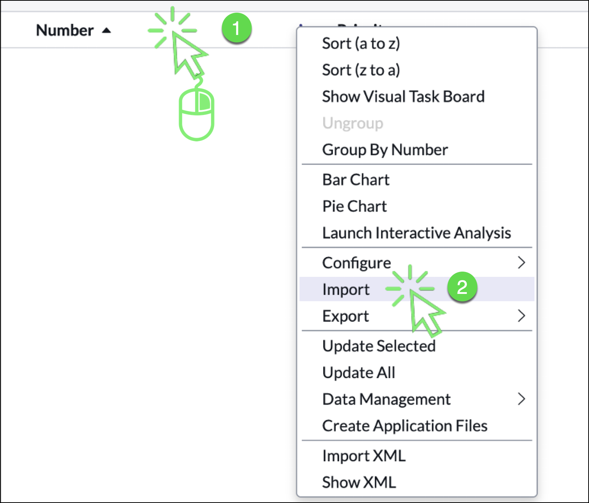
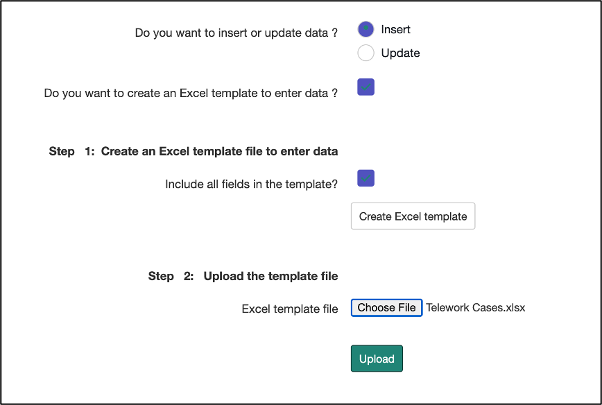
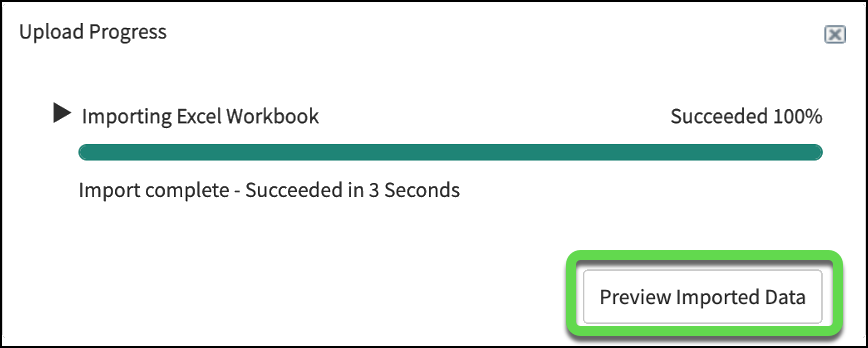
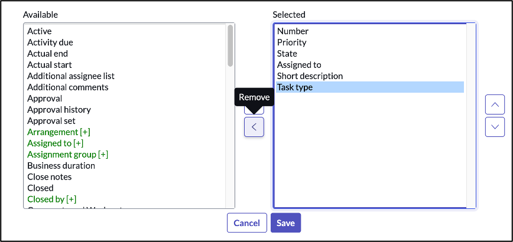
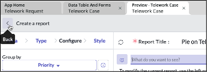
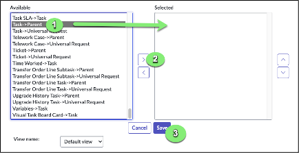

## Import Cases

1. Hover the column header **Number** , **right-click** to display the table menu options and then select **Import.**

    

2. Select **Choose File** to upload the Excel file: Telework Cases.xlsx

    

3. Click **Upload** and wait until the import is complete.

    

4. Once loaded, click on **Preview Imported Data**

    

5. Scroll down and click on the **Complete Import** button

    

6. You'll now see that we have migrated our data.

    

7. Let's update the columns in this list layout.

8. Right click at the top of the Number column and click on "Configure" -\> "List Layout"

    

9. Move "Task type" to the left hand window and click Save
    

Next, let's start working and managing our records

10. Hover the column header **Priority** , **right-click** to display the menu and then select **Pie Chart**

    

11. And voila, we get a Pie chart that shows us the distribution of cases by Priority

    

12. Explore the other tools in the Context Menu such as Visual Task Board
    
13. The team struggles managing and understand the status of related tasks. Let's fix that.
    
14. Click the back button on the Pie Chart report to get back to the list
    

15. Open a record by clicking the number field

    

16. Configure the related list by doing:

    1. Right-click on header
    2. Select **Configure**
    3. Then select **Related Lists**

    

17. In the new form:

    1. Select the item " **Task → Parent**"
    2. Click on the button to move the item to the selected list
    3. Click he [Save](#){: .aes_button }

    

Now a new tab at the bottom of the form will show records that have relationships to the current record.

    

18. Go back to the list view by clicking on the back button at the top

    

19. We can even start creating new records/cases

20. Click \_New\_ in the top right
    

21. Fill out the form and click "Submit" to create a test record.

22. Close the Table Builder and Preview tab by **clicking** the **X** on them.
    

[Next: User Interface]( ./Part_4.2_Configure_the_Workspace.md){: .btn .btn-green-sn }