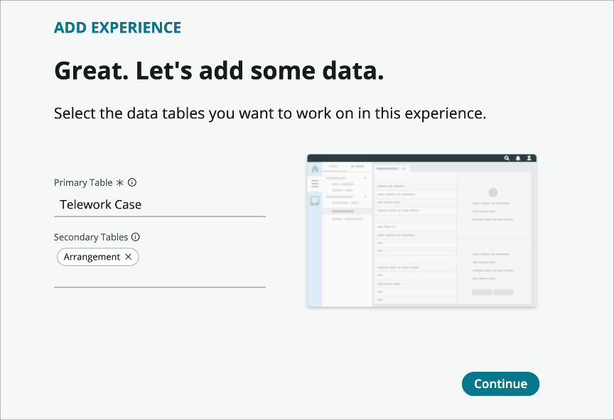
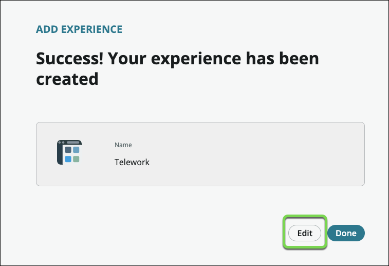
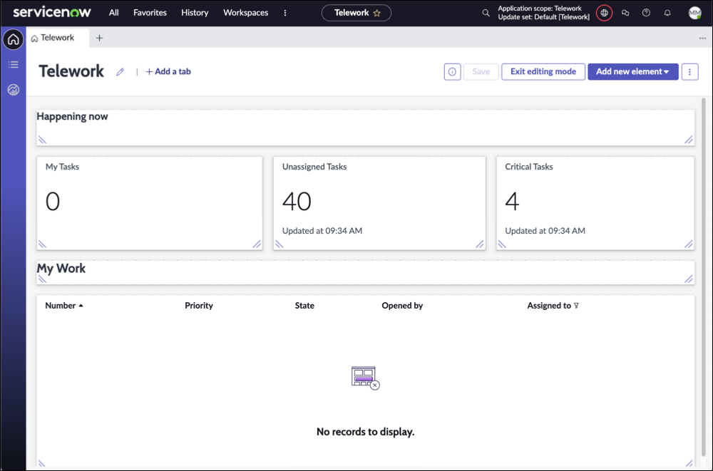

## 1 – Create a Workspace Experience

We will now create and configure the Workspace experience for our new application.

1. On the application homepage, locate the **Experience** section and click the **⨁ Add icon**
    
    This takes us to a selection where we can identify the type of experience we wish to create.

2. **Click** the **Workspace** option to create a workspace to help users manage and fulfill requests sent to them
    

3. This launches the workspace Creator. Click the [Begin](#){: .aes_button } button

    

4. Next, leave the default value and Click [Continue](#){: .aes_button }

    

5. Next, we'll select the tables we want to work with in this workspace.

6. Set the **primary** and secondary tables to: **Telework Case** and **Arrangement** like below and Click [Continue](#){: .aes_button }

    Field Name           | Field Value
    ---------------------| --------------
    (1) Primary table    | Telework
    (2) Secondary tables | Arrangement

    

    

7. Your new Workspace experience is completed.  Click [Edit](#){: .aes_button }

    

8. We are now directed to the Workspace Builder. Click [Get Started](#){: .aes_button } 

    

9. We now have a fully functioning workspace to get work done quickly.

    

    {: .note}
    The Workspace Builder for App Engine allows you to manage dashboards, build lists, and customize record pages for workspaces created in App Engine Studio. App Engine licensed customers enjoy exclusive access to this premium feature.

Next, let's tailor the workspace to our needs.

[Next: Workspace configuration](./Part_4.2_Configure_the_Workspace.md){: .btn .btn-green-sn }

