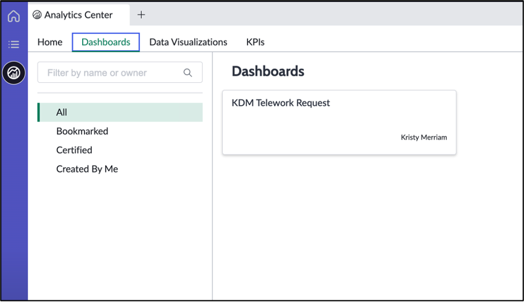

# Configure the Workspace

The Workspace Builder empowers users of all skill sets to build a custom workspace in a no-code environment. With this builder, you can quickly create a workspace and configure its layout, lists, and record pages. If you need access to more advanced functionalities and configurations, you can open the workspace in UI Builder from within this builder.

A lot has been pre-configured for us. We'll make a couple changes to improve it.

1. Let's make sure the scores point to our table

2. 

Let's use the Analytics Center to configure a new Dashboard for our needs.

1. In Analytics Center, click on **Dashboards** , then choose the dashboard created for your workspace

    

2. Once the dashboard opens, click Edit in the top right of the screen

    

    The screen should look similar to below

    

#TODO

3. Click on **Add new element** in top right of screen
 

4. Find **Data visualization** in the list and select it

1. Drag and drop the new data component from the bottom of the dashboard to right above the My Work section and size it to expand across the screen
 
2. On the new component, click the  . This will bring up the Configuration window on the right

3. In the configuration side panel, find **Visualization Type** , then select "Vertical bar"
 

4. Click on **Header and border** to expand that section, then type "Cases by Priority" in the **Chart Title** field
 

5. Under Data sources, click **+ Add data source**. In the window that opens, choose the Telework Case table as the source
 

6. Click **+ Add Custom Condition** and configure the filter like below
 

7. Click Add this source
 

8. In the **Group by** section, (_see screenshot below_)

  1. Click the pencil icon next to "Active"
  2. Click "Active" in the drop-down
  3. Type "priority" in the search
  4. Click the word "Priority"
  5. Click Apply

 

1. Click **Save** hen **Exit Edit Mode** on the top right to see your new dashboard!
 

**Exercise Recap**

In this exercise, we learned how to create a custom workspace using UI Builder and used the Inline Dashboard Editor to display key performance indicators and organize information in ways that benefit our users.
