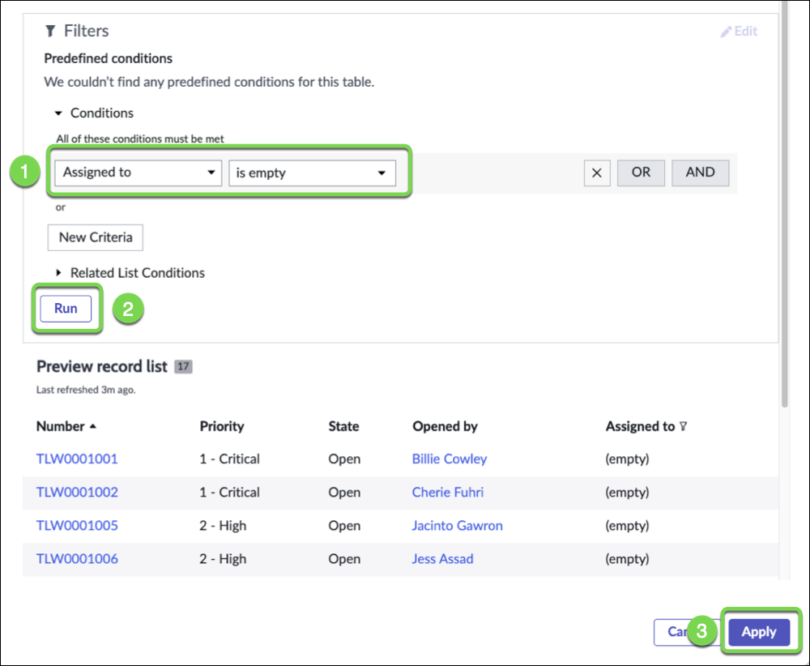
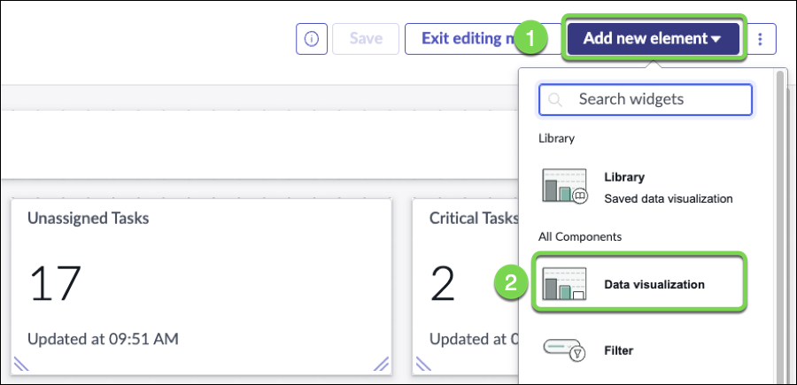

# Configure the Workspace

The Workspace Builder empowers users of all skill sets to build a custom workspace in a no-code environment. With this builder, you can quickly create a workspace and configure its layout, lists, and record pages. If you need access to more advanced functionalities and configurations, you can open the workspace in UI Builder from within this builder.

A lot has been pre-configured for us. We'll make a couple changes to improve it.

1. Let's make sure the scores point to the Telework table

2. **(1)** Click the **Unassigned Tasks** score, **(2)** Click Configure **(3)** Click the Task table

    

3. **(1)** Type "Telework", **(2)** <kbd>⏎ Enter</kbd>, **(3)** Click the Telework table, **(4)** Click **Add custom conditions**

    

4. Set the Condition to **Assigned to = Empty**
    1. Set the condition
    2. Click Run
    3. Click Apply

    

5. **(1)** Click the **Critical Tasks** score, **(2)** Click Configure **(3)** Click the Task table

    

6. **(1)** Type "Telework", **(2)** <kbd>⏎ Enter</kbd>, **(3)** Click the Telework table, **(4)** Click **Add custom conditions**

    

7. Set the Condition to **Priority = Critical**
    1. Set the condition
    2. Click Run
    3. Click Apply

    

8. Click **Save**

    

Now, let's help the business users visualize quickly cases by priority.

1. Add a new Data Visualization. At the top, (1) Click on **Add new element**, **(2)** select **Data visualization** 

    

2. Scroll down, the component has been added at the bottom of the page

3. Drag and drop the new data component from the bottom of the dashboard to right above the My Work section and size it to expand across the screen

    

4. On the new component, click the configure icon

    

5. In the configuration panel, **(1)** Click the **Visualization Type** , **(2)** type "vert" **(3)** select "Vertical bar"

    
 
 6. **(1)** Click on **Header and border** to expand that section, **(2)** type "Cases by Priority" in the **Chart Title** field

    
 
7. Under Data sources, click **+ Add data source**.

    

8. In the window that opens, choose the Telework Case table as the source. **(1)** Type "Telework", **(2)** <kbd>⏎ Enter</kbd>, **(3)** Click the Telework table, **(4)** Click **Add custom conditions**

    

9. We want to see only the non-closed cases. 

    1. Set the filter like below. Hold the <kbd>⇧ Shift</kbd> key to select multiple values

    2. Click **Add this source**

    

8. In the **Group by** section, 

   1. Click the pencil icon next to "Active"
   2. Set **Priority** for the Group by
   3. Click Apply

    

9. On the top right, Click **Save** hen **Exit Edit Mode** 

    

### And voilà, your new dashboard!

   

## Exercise Recap

In this exercise, we learned how to create a custom workspace and used the the Workspace Builder to display key performance indicators and organize information in ways that benefit our users.

[Next > Use the Workspace](./Part_4.4_Use_the_Workspace.md){: .btn .btn-green-sn }
