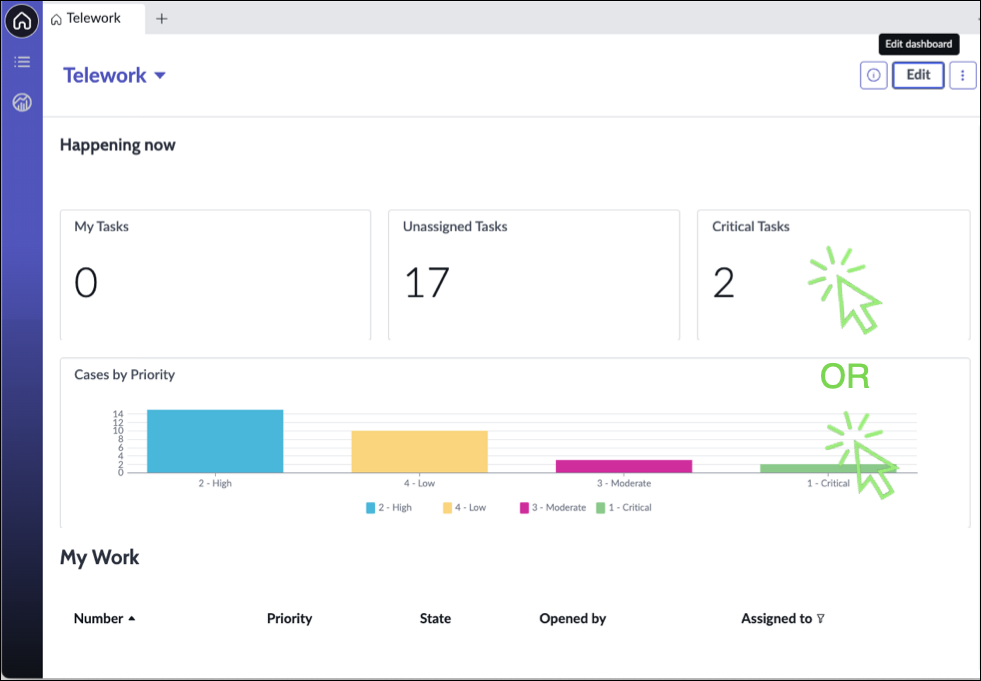

## Use the Workspace

1. Let's take care of the **Critical Tasks**. Click on the **Critical Tasks** score or the critical bar chart

    

2. Select all rows, Click **Edit** , Select **Assign to me** , Click **Back**
    

3. Refresh the **My Tasks** score. You now have 2 tasks assigned to you.

    

4. In the **My Work** list, click on the **Assigned to** header to refresh the list

    

17. **Great!** Now let's see how quick we can handle an emergency ⚠️.

 Our team member _Luke Wilson_ is out sick today. We need to reassign his work to another case worker. (_It is hard to do when the work is managed via emails and spreadsheets!_)

### Bulk Assignment

1. Click the List icon.

    

2. Click on **Open** in the Telework Case section

    

3. Click the button next to "Luke Wilson" and click "Show Matching"

     

4. Select all rows, then click **Edit**
    
    

5. Type "Andrew Och" in the "Assigned to" field, then click his name in the drop down
 
6. Click Update
7. You should see this message:
 

### Finding Answers with the Analytics Center

1. Now let's check the Analytics Center to quickly find the data we need
2. Click the Analytics Center button
 

1. Let's ask some question about our data
2. Note: As you type in a query, Analytics Q&A suggests recent searches, indicators, tables, and columns that match what you have typed so far. Only the tables and columns to which you have access are shownClick In the box "What do you want to see?" then type the following query:

 "show me all the telework cases grouped by reason as a bar chart"

 

3. Click the button Ask

1. And here is the answer

1. In the query box remove the part "show me all the". It should read as:
 "telework cases grouped by reason as bar chart"
2. Click the Ask button, and we'll get the same result
3. Try with "as pie chart"
4. Try with "as list". (You can ask for a list first, ex: "list of telework cases grouped by reason"
5. It even understands our own data; Try with "open COVID telework case"

**Exercise Recap**

In this exercise, we learned how to generate a new Workspace and explored the out-of-the-box capabilities.